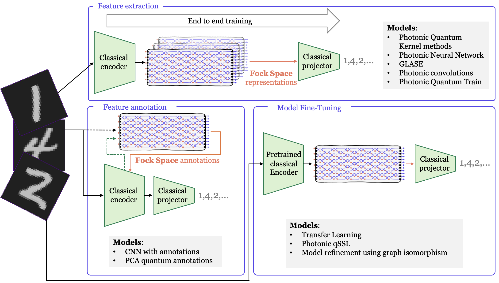

# The Perceval Quest

<table align="center" bgcolor="black">
<tr>
  <td bgcolor="black" align="center" width="200"></td>
  <td valign="middle" style="font-size: 24px; font-weight: bold; padding: 0 20px;">×</td>
  <td bgcolor="black" align="center" width="200"></td>
</tr>
</table>

<div align="center">
  
</div>

## :rocket: Quantum Machine Learning Solutions

This repository presents the winning solutions from the First Perceval Quest, where 64 teams explored hybrid quantum-classical approaches to the MNIST digit classification problem. The final competition featured 11 innovative models that demonstrate different quantum machine learning techniques using photonic quantum computing.

All solutions are available in the [src](./src) directory with detailed documentation in the associated [README](./src/README.md).

Here, we present different original ways to solve a unique problem.

## :arrow_forward: Running the Solutions

You can easily run any of the quantum machine learning solutions using the provided run script. First, set up your environment:

```bash
# Create a virtual environment
python -m venv quest-venv
source quest-venv/bin/activate
pip install -r requirements.txt
```

This installs the MerLin framework ([documentation](https://merlinquantum.ai/index.html)) for photonic QML implementation.

### Running Examples

Use the `run` script to execute different solutions:

```bash
# Photonic interferometers as feature extractors
./run q_kernel
./run photonic_qNN
./run tristan
./run GLASE
./run PQK
./run QuantumTrain

# Photonic interferometers for quantum annotations
./run solal

# Photonic interferometers for model fine-tuning
./run photonic_SSL
./run TransferLearning

```

**Note**: These examples use basic hyperparameters and may not represent the fully optimized versions submitted during the competition.

---

## :zap: About the Perceval Quest Challenge

The First Perceval Quest was jointly organized by Quandela and Scaleway to explore the intersection of quantum computing and machine learning through one of the most iconic machine learning benchmarks - the MNIST dataset.

The challenge tackled the well-known MNIST problem using hybrid quantum models on a subset of the original dataset. The MNIST dataset consists of 70,000 handwritten digit images, each 28x28 pixels. For this quest, participants worked with a reduced dataset of 6,000 images and used quantum approaches to predict the digits.

:calendar: This challenge ran from November 2024 to March 2025. Overall, 64 teams joined the Perceval Quest and 11 were selected for the final phase.

### Historical Context & Challenge Overview

The MNIST (Modified National Institute of Standards and Technology) dataset was introduced by Yann LeCun et al. in 1994 and has served as a fundamental benchmark in the machine learning community for almost 30 years. This collection of handwritten digits has been instrumental in testing and validating numerous computer vision approaches, from traditional machine learning to deep neural networks.

While modern classical methods have achieved near-perfect accuracy on MNIST, this challenge took a different approach. The quest revisited this iconic benchmark through the lens of quantum machine learning, not with the goal of surpassing classical accuracy records, but to explore novel quantum techniques and methodologies. To make the challenge more suitable for quantum processing, participants worked with a reduced dataset of 6,000 images instead of the original 70,000, adding an interesting constraint that made the problem more challenging and relevant for quantum approaches.

### :bulb: Photonic Quantum Computing at Quandela

This challenge leveraged photonic quantum computing, a promising quantum computing paradigm that uses light particles (photons) as quantum bits. Participants used the Perceval framework, an open-source platform developed by Quandela for programming photonic quantum computers. You can learn more about Perceval and its capabilities at [perceval.quandela.net](https://perceval.quandela.net).

### Quantum Computing Resources

Participants could develop small scale algorithms using local simulation and in phase 2, they were able to access [Scaleway's Quantum-as-a-Service platform](https://labs.scaleway.com/en/qaas/), which provided both large-scale quantum simulators and actual QPU access. This platform enabled participants to test and run their quantum algorithms in both simulated and real quantum environments.

### Repository Organization

The dataset is located in the [`data`](./data) folder, containing [`train.csv`](./data/train.csv) and [`val.csv`](./data/val.csv) files. 
The notebook [`MNIST_classification_quantum.ipynb`](./src_PercevalQuest/MNIST_classification_quantum.ipynb) and its equivalent script, [`training.py`](./src_PercevalQuest/training.py), contain the training loop used for model training.

An example code for building quantum embeddings and integrating them into a basic classical model is split in separate scripts: the model is defined in [`model.py`](./src_PercevalQuest/model.py), the Boson Sampler in [`boson_sampler.py`](./src_PercevalQuest/boson_sampler.py) and some helper functions (dataset class for the reduced dataset, accuracy function...) can be found in [`utils.py`](./src_PercevalQuest/utils.py). 

### Challenge Rules

- Use any classical machine learning model and demonstrate improved performance with a quantum model
- Submit your solution as a reproducible Jupyter notebook
- Modify the provided quantum model as needed. It can rely on quantum kernels or other methods

### :inbox_tray: Contact & Support

Email perceval-challenge@quandela.com with your team description (individual or group entries welcome). You'll receive confirmation and submission instructions.

For any general questions, please use Perceval Forum at https://perceval.quandela.net/forum/ with the tag `Perceval Quest`.
For technical questions, please use the GitHub Discussions tab in this repository.
