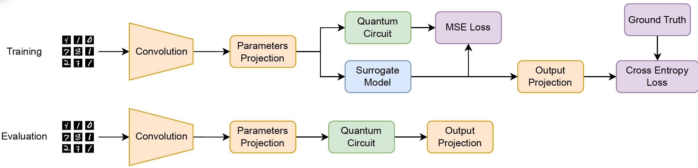
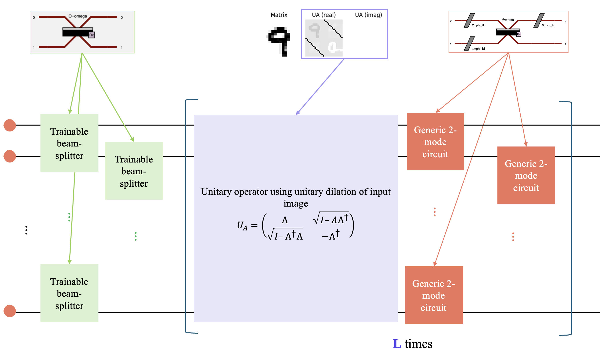
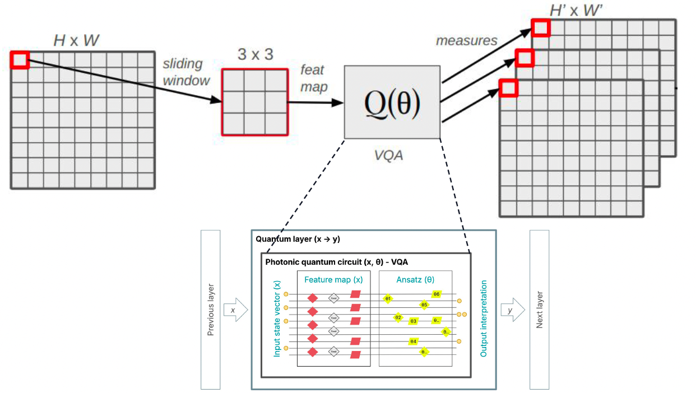
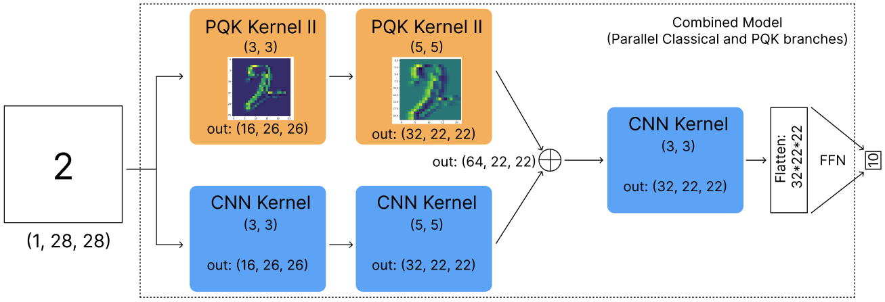
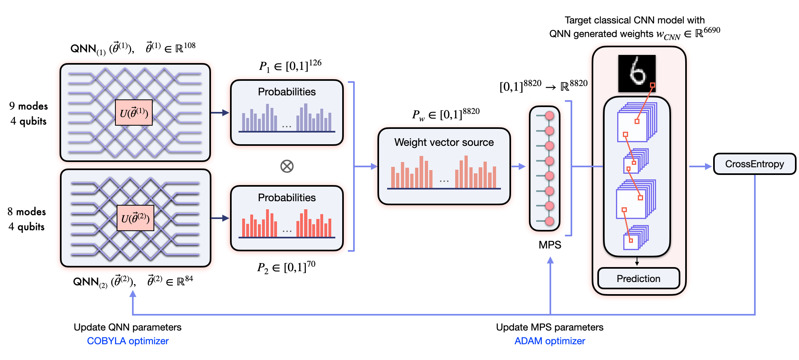
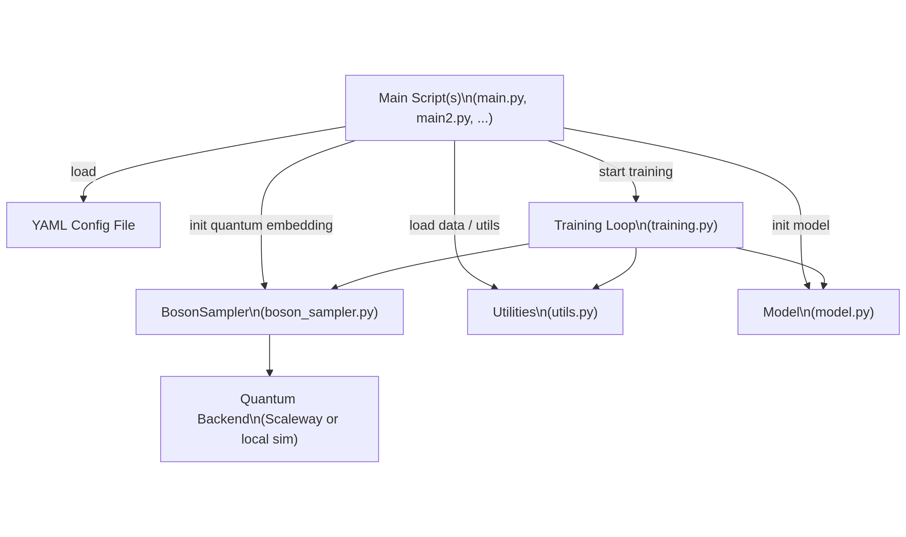
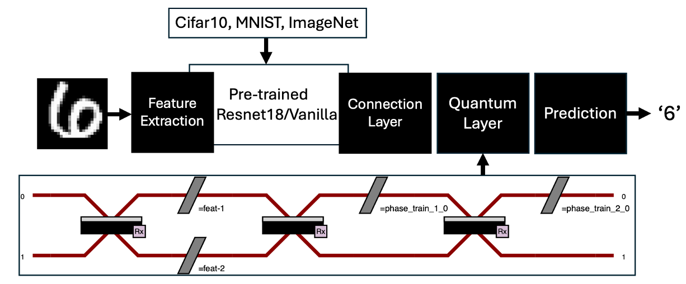

# Models proposed

## :art: 1. Photonic interferometer used for Feature extraction
### A Photonic Quantum Kernel Support Vector Machine

A quantum kernel specifically adapted to photonic quantum computers was developed and compared against classical support vector machines (SVMs). The quantum model uses a photonic interferometer to encode PCA-processed images into a high-dimensional quantum Hilbert space. Photon measurements yield a fidelity-based kernel, which is then passed to a classical SVM for classification.


### A Photonic Quantum Neural Network
The photonic quantum Neural Network is a hybrid quantum classical model made of trainable generic interferometers (in purple), an encoding layer (in gray), a learnable scale layer and a linear layer for class mapping.
<div align="center">
  
</div>

To run: `python3 photonic_qNN/main.py`

#### Arguments for photonic qNN:
- `--bs`: Batch size (default: 64)
- `--lr`: Learning rate (default: 0.05)
- `--modes`: Number of modes in the interferometer (default: 10)
- `--epochs`: Number of epochs to train the model (default: 10)
- `--size`: Size of the images that is used (default: 28)
- `--pca`: Define if PCA is applied on the data (default: False)
- `--pca_comp`: Number of PCA components used (default: 8)
- `--display`: Display layers, ConfMat and tSNE (default: False)

### GLASE
GLASE is a QNN framework that estimates the gradients of the photonic QNNs using a seperate classical surrogate model during training to avoid training instabilities or barren plateaus.
<div align="center">
  
</div>

#### Training the Model

Run the training script with default hyperparameters or specify your own using command-line arguments. For example:

```bash
python ./GLASE/train.py --m 20 --n 3 --batch_size 256 --lr 2e-3 --weight_decay 1e-3 --epochs 50 --label_smoothing 0.1
```

#### Plotting Training Results

To visualize the training metrics after training both QNN and CNN, use the plotting script.

```bash
python ./GLASE/plot_result.py --files qnn.pkl cnn.pkl
```

### Lancelot: leveraging unitary dilation matrix for feature extraction

This work explores how Linear Optical Quantum Computing (LOQC) can augment a classical convolutional neural network (CNN) on the MNIST handwritten digits task.
The hybrid approach maps each pooled image to an interferometer built with Perceval components:

1. Images are down-sampled via max pooling, reshaped into Hamiltonians, and converted to unitary matrices using a dilation trick.
2. A brickwork circuit composed of programmable beam splitters and generic two-mode gates encodes optical parameters (`BS_params`, `omega_params`).
3. Photon sampling (with optional Scaleway remote acceleration) estimates mean spatial distributions which serve as features for a classical dense classifier.
4. Optical parameters are optimised with SPSA or CMA-ES, while the classical layer is fine-tuned with gradient descent.

<div align="center">
  
</div>

#### Training the Model

```bash
python ./Lancelot/main.py hybrid
```


### Tristan : A quantum 2d convolution-based network implementation
Inspired by [S. Shi, et al](https://arxiv.org/pdf/2303.03707), our implementation (Fig. 1) replaces the dot product of traditional convolution by a quantum circuit while keeping the sliding window principle. Our quantum implementation is a photonic circuit with two parts: a feature map and an ansatz. The feature map uses a fixed input Fock state and contains beam splitters and phase shifters, with some parameters that are fixed and others that depend on input pixel values.

- [See our topology](tristan/qml/models/topologies/tristan.py)
- [See our feature map](tristan/qml/models/layers/quantum/feature_maps/achilles.py)
- [See our ansatz](tristan/qml/models/layers/quantum/ansatz/penarddun.py)
- [See our paper](tristan/docs/qaradoq-report.pdf)

<div align="center">
  
</div>


### Quantum Hybrid Neural Networks (PQK)

#### Models

1. **Single Layer Model** (`Type2_TrainableKernel__Hybrid`)
   - One quantum convolutional layer
   - Classical fully connected layers

```bash
python main.py --model single --epochs 10
```

2. **Two Layer Model** (`Type2_TrainableKernel__Hybrid__2_layers`)
   - Two quantum convolutional layers
   - Classical fully connected layers

Two quantum layer model:
```bash
python main.py --model 2layer --epochs 10
```

3. **Combined Model** (`Type2_TrainableKernel__Hybrid__2_layers__combined_parallel`)
   - Parallel classical and quantum branches
   - Feature fusion layer
   - Best performance from the notebook examples

```bash
python main.py --model combined --epochs 10
```

<div align="center">
  
</div>

#### Example with all options
```bash
python main.py --model combined --epochs 20 --batch-size 64 --lr 1e-5 \
                --save-model ./trained_model.pth \
                --save-embeddings --log-dir ./training_logs
```

### A Photonic Quantum Train
The photonic quantum train framework utilizes parameterized photonic quantum gates and a tensor network mapping model
to generate parameters for classical neural networks (NNs) efficiently

Prior to running, we recommend to download TorchMPS from our [participants' repository](https://github.com/Louisanity/TorchMPS) 

<div align="center">
  
</div>

To run: `python3 QuantumTrain/main.py`
You can vary the bond dimension by using `--bond_dim 5` arguments (default is `7`). To run classical experiments, you can run
- for weight sharing:  `python3 QuantumTrain/main.py --weight_sharing`
- for pruning:  `python3 QuantumTrain/main.py --pruning`


## :pencil2: 2. Photonic interferometers for quantum annotations and feature engineering

### A Photonic QNN as a features extractor

A hybrid classical quantum photonic neural network is implemented and trained on a subset of MNIST. 
After reducing the images sizes using PCA, the quantum photonic circuit is used as feature extractor. 
The quantum layer is implemented using the `MerLin` library.
These quantum features are then concatenated with the classical ones to classify the input images.
The penultimate classical layer is used to shift the classes's disttibution closer to the uniform one.

Besides MNIST, the quantum layer is also shown to work with some classical non linearly separable dataset such as the moons and circles (cf `examples/pqnn.ipynb`).


#### To train and test the model

```bash
python solal/main.py
```

### A CNN with quantum annotations

This project explored a hybrid photonic-classical MNIST classification that prioritizes methodological originality over accuracy within the Perceval Quest constraints (6k-image subset). We combine a lightweight classical classifier with a photonic feature extractor using a Perceval circuit with trainable interferometric blocks and input-dependent phase encoders. The direct-circuit formulation uses classical features to modulate phase shifters for data encoding.

We use bilinear or PCA-based compression to downsample images, map phase parameters to drive a boson-sampling circuit 
using GenericInterferometer meshes (triangular/rectangular variants) with optional post-selection, and create a quantum embedding 
vector from detection outcomes to concatenate with the classifier's input. A classical PCA baseline with the same parameter budget 
for unbiased comparison, training/evaluation utilities.

Initial tests indicate that photonic embedding may operate as a feature map with low parameter counts. 
However, due to limited dataset size and simulator/QPU constraints, accuracy deltas should not be overinterpreted. 
Instead, we prioritize reproducibility (fixed configs, logged seeds, explicit downsampling), ablation levers (encoding, interferometer shape, sampling strategy), and MerLin's QuantumLayer future compatibility for benchmarking and speedups.

<div align="center">
  
</div>


#### To run
This project can be run in 2 modes:
- **Classical mode:** : `python3 src/main.py classic`
- **Quantum hybrid mode:**: `python3 src/main.py hybrid`

Please note that if you change the [config](AnnotCNN/yaml_default_config.yaml), you will need to first run the `classic` baseline to generate the PCA components !

## :rocket: 3. Photonic interferometers for model fine tuning
### A quantum Self Supervised Learning framework
The photonic quantum self supervised learning framework leverages a photonic interferometer as the projector from the representation space to the loss space.
<div align="center">
  
</div>

To run: `python3 photonic_SSL/main.py`

#### Arguments for photonic qSSL:

**Data parameters:**
- `-cl, --classes`: Number of classes (default: 10)
- `-s, --size`: Size x size of the image (default: 20)
- `-d, --datadir`: Data directory (default: './data')

**Training parameters:**
- `-e, --epochs`: Number of epochs for training (default: 10)
- `--ft-epochs`: Number of epochs for fine tuning (default: 10)
- `-bs, --batch_size`: Batch size (default: 128)

**SSL model parameters:**
- `-bn, --batch_norm`: Set if we use BatchNorm after compression of the encoder
- `-bck-d, --backbone-dim`: Dimension of the backbone output (default: 64)
- `--cnn`: Backbone is CNN if True, MLP otherwise
- `--enc-dim`: Dimensions of the encoder (default: [8, 8])

**Contrastive Loss parameters:**
- `-tau, --temperature`: Temperature of the InfoNCELoss (default: 0.07)

**Quantum SSL parameters:**
- `-w, --width`: Dimension of the features encoded in the QNN (default: 8)
- `-quant, --quantum`: Set if we use Quantum SSL
- `-m, --modes`: Number of modes (default: 10)
- `--no_bunching`: NoBunching mode for the quantumlayer
- `--trained`: If Boson Layer is trained

**Display parameters:**
- `--no-plots`: Disable plot display

### A Transfer Learning approach


A transfer learning implementation that combines classical ResNet18 architecture with quantum computing layers using Perceval and MerLin. The script provides both quantum and classical classification modes for MNIST digit recognition:

- **Quantum Mode**: Integrates quantum photonic circuits as the final classification layer, replacing traditional fully connected layers with quantum interference patterns
- **Classical Mode**: Uses standard neural network layers for comparison
- **Transfer Learning**: Leverages pre-trained ResNet18 weights from ImageNet, freezing the backbone and training only the classification head
- **Flexible Configuration**: Supports custom digit selection, quantum circuit parameters, and training hyperparameters



**Key Features:**
- Quantum circuit construction with configurable modes and encoding schemes
- Hybrid classical-quantum neural network training
- MNIST dataset preprocessing and augmentation
- Training metrics visualization and model evaluation

To run: `python3 TransferLearning/main.py --quantum --digits 1 5 8`
